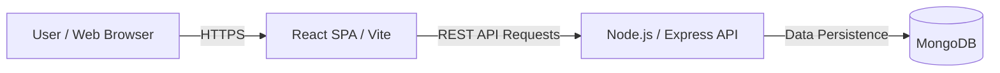

# Replate - Food Redistribution Platform (Frontend)

This repository contains the frontend web application for **Replate**, a community-driven platform designed to reduce food waste by connecting surplus food donors with NGOs and volunteers.

---

## 🛠️ DevOps & Developer Documentation (DevDocs)

### 1. Introduction
The **Replate Frontend** serves as the client-side interface for all platform roles. It provides a responsive and intuitive dashboard for donors to list food, NGOs to claim requests, and volunteers to manage deliveries. The goal is to facilitate seamless, real-time coordination to ensure surplus food reaches those in need efficiently.

### 2. System Architecture
The frontend is built as a Single Page Application (SPA) using React and Vite. It follows a modular component-based architecture and communicates with the backend via RESTful APIs.



*   **Routing**: Client-side navigation handled by `react-router-dom`.
*   **State Management**: Optimized using React Context API and local state hooks.
*   **Maps Integration**: Real-time visualization using `react-leaflet`.

### 3. Technology Stack
*   **Core Framework**: React (v19)
*   **Build Tool**: Vite (Next-generation frontend tool)
*   **Styling**: Tailwind CSS (Utility-first CSS framework)
*   **Icons**: Lucide React
*   **HTTP Client**: Axios
*   **Testing**: Playwright (E2E testing)

### 4. Repository Structure
The project is organized to ensure maintainability and clear separation of UI, logic, and services.

| Directory | Description |
| :--- | :--- |
| `src/api/` | Centeralized API calls and Axios configuration. |
| `src/components/` | Reusable UI components (Modals, Navbars, Layouts). |
| `src/pages/` | Primary page views (Admin, Donor, NGO, Volunteer). |
| `src/hooks/` | Custom React hooks for shared logic (Voice Recognition, etc.). |
| `src/assets/` | Static assets including images and global styles. |
| `tests/` | Playwright E2E test specifications. |

### 5. CI/CD Pipeline
We leverage automated workflows to maintain high code quality and reliable deployments.

*   **Continuous Integration (CI)**:
    - Automatically triggered on `push` and `pull_request` to `main`.
    - Installs dependencies using `npm ci`.
    - Runs **Playwright** E2E tests to prevent regressions.
    - Configured in `.github/workflows/playwright.yml`.

*   **Continuous Deployment (CD)**:
    - Successfully tested builds are eligible for deployment to **GitHub Pages** or **Render**.
    - The `npm run deploy` script handles the production build and synchronization.

### 6. Local Development Setup
Follow these steps to set up the project on your local machine:

1. **Prerequisites**: Ensure you have [Node.js](https://nodejs.org/) (v18+) installed.
2. **Installation**:
   ```bash
   npm install
   ```
3. **Environment**: Create a `.env` file in the root:
   ```env
   VITE_API_URL=http://localhost:5000
   ```
4. **Execution**: Start the dev server:
   ```bash
   npm run dev
   ```

### 7. Deployment Process
1. **Build**: Create an optimized production bundle:
   ```bash
   npm run build
   ```
2. **Preview**: Verify the build locally:
   ```bash
   npm run preview
   ```
3. **Deploy**: Push to the `main` branch to trigger the automated deployment pipeline on the hosting provider (e.g., Render/GitHub Pages).

### 8. Monitoring & Logging
*   **Infrastructure Logs**: Build and deployment statuses are monitored through **GitHub Actions** and the hosting provider's dashboard.
*   **Error Tracking**: Production errors are identified through browser-based console monitoring and deployment platform logs.
*   **Performance Monitoring**: Vite's build reports provide insights into bundle sizes and asset optimization.

### 9. Security Considerations
*   **Environment variable protection**: Critical API endpoints are managed via environment variables and never exposed in the source code.
*   **Stateless Auth**: Uses JWT (JSON Web Tokens) stored in secure browser storage for session management.
*   **RBAC Implementation**: Frontend routing guards ensure users can only access views authorized for their specific role (Donor, NGO, Volunteer, Admin).
*   **XSS Protection**: React's built-in data binding prevents most common cross-site scripting attacks.

---

## License
This project is licensed under the MIT License - see the LICENSE file for details.
